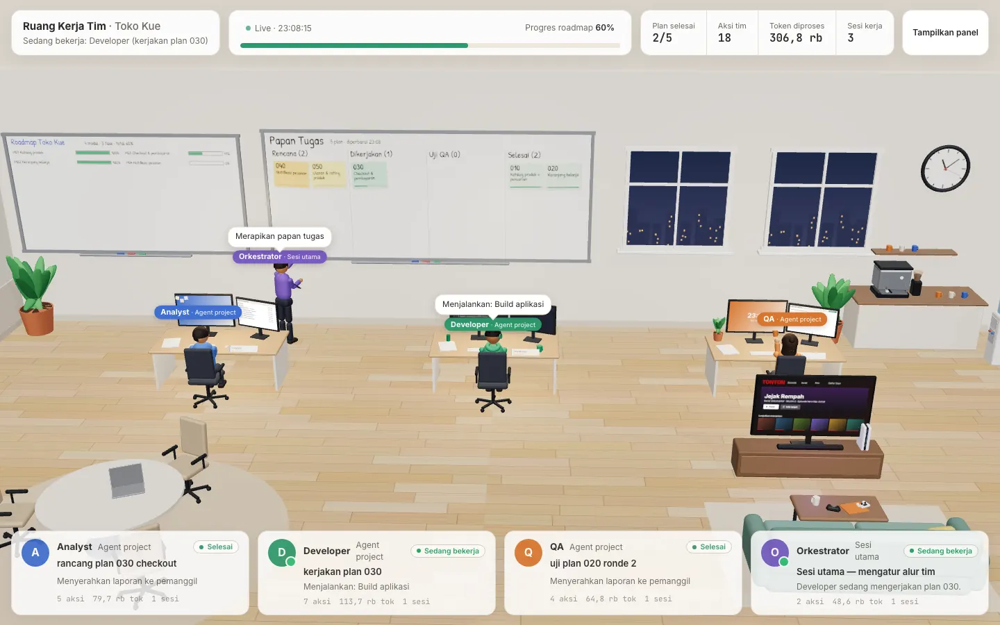
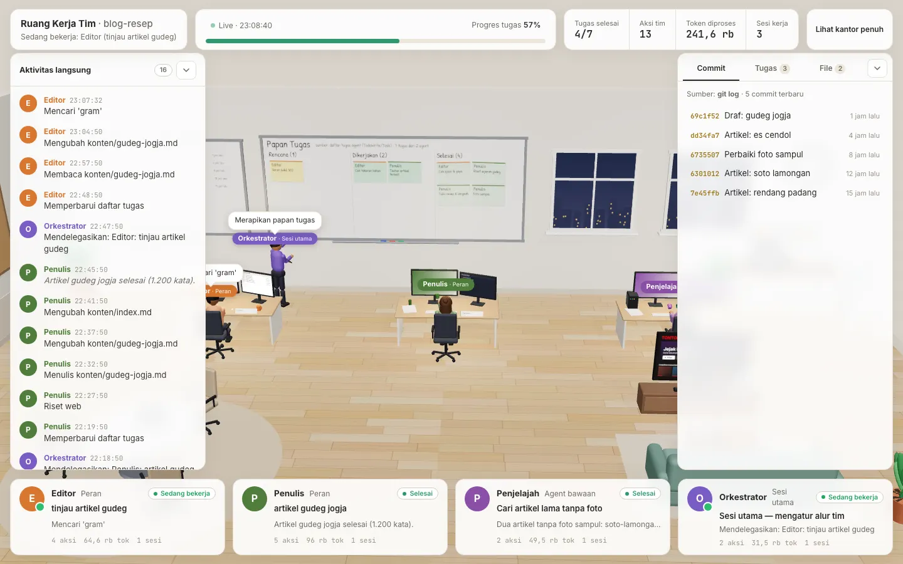
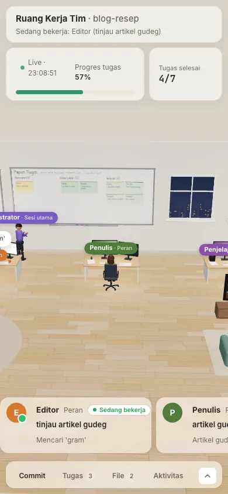

# Kantor 3D — lihat agent Claude Code-mu bekerja

> **English summary.** Kantor 3D is a [Claude Code](https://code.claude.com) plugin (a single skill) that installs a
> read-only, zero-config dashboard at `<host>/kerja`: a three.js office where every Claude Code agent of your project
> sits at a desk and works, waits, or takes a break — driven only by real data (the project's Claude Code transcripts
> in `~/.claude/projects`, plus `planning/` and `git log` when present). Runs on PHP ≥ 8.1 **or** Node ≥ 18 (Valet,
> `php -S`, Node, Nginx), optional public tunnel via cloudflared. Install with
> `/plugin marketplace add sambu-la/kantor-3d` → `/plugin install kantor-3d@kantor-3d`, then run
> `/kantor-3d:kantor-3d` in your project. The UI and docs are in Bahasa Indonesia. MIT licensed.



**Kantor 3D** memasang halaman satu layar di `<host>/kerja` yang menampilkan agent Claude Code sebuah project sebagai
karyawan di kantor 3D. Siapa sedang mengerjakan apa, file apa yang diubah, tugas mana yang selesai, siapa menunggu
keputusanmu — semuanya dari **data nyata**, tanpa login dan tanpa konfigurasi. Cocok untuk project apa pun yang
dikerjakan lewat Claude Code: aplikasi, konten, riset, sampai job terjadwal `claude -p`.

Ingin sekalian membentuk **tim agent** (Analyst → Developer → QA, dll.) dengan alur rancang → kerjakan → review?
Pakai plugin saudaranya, [**claude-tim-ai-3D**](https://github.com/sambu-la/claude-tim-ai-3D) — ia memasang Kantor 3D
ini otomatis sebagai dependensi.

## Daftar isi
- [Fitur](#fitur) · [Kebutuhan](#kebutuhan) · [Mulai cepat](#mulai-cepat-plugin) · [Pasang manual](#pasang-manual)
- [Contoh pemakaian](#contoh-pemakaian-langkah-demi-langkah) · [Cara kerja](#cara-kerja) · [Konfigurasi](#konfigurasi)
- [Mode menjalankan](#mode-menjalankan) · [Memperbarui](#memperbarui) · [Mencopot](#mencopot)
- [Masalah umum / FAQ](#masalah-umum--faq) · [Privasi](#privasi) · [Batasan](#batasan) · [Kontribusi](#kontribusi) · [Lisensi](#lisensi)

## Fitur
- **Nol konfigurasi.** Peran, nama, warna, dan gaya karakter ditemukan otomatis dari `.claude/agents/*.md`,
  `agentType` subagent di transkrip, atau awalan deskripsi (`Penulis: …`). Maksimal 6 meja; sisanya kartu "+N".
- **Data nyata saja.** Tidak ada aktivitas → karakter istirahat (nonton, ngopi, ngobrol). Tidak ada data papan →
  papan kosong dengan keterangan sumbernya.
- **Dua mode papan dinding:**
  - `planning` — bila project punya `planning/` (format tim-ai): roadmap, papan tugas per plan, keputusan, laporan QA.
  - cadangan `auto` — tanpa `planning/`: daftar tugas agent (TodoWrite/Task), `git log`, file yang paling sering diubah.
- **Feed langsung** aksi agent (baca/tulis file, perintah, delegasi) — ringkasan saja, rahasia diredaksi.
- **PHP ≥ 8.1 atau Node ≥ 18**, rute & JSON identik (dijaga `bin/parity.mjs`). Tanpa dependensi npm/composer.
- Responsif: desktop dan ponsel (panel bawah, kartu bergeser horizontal).

| Mode cadangan (tanpa `planning/`) | Ponsel | Mode istirahat |
|---|---|---|
|  |  |  |

> Semua tangkapan layar di atas berasal dari project demo dengan transkrip sintetis.

## Kebutuhan
| Komponen | Keterangan |
|---|---|
| **Claude Code** | Versi yang mendukung plugin & marketplace (`/plugin`) dan subagent. Diuji di v2.1.283. Untuk pasang manual, versi apa pun yang mendukung skills. |
| **PHP ≥ 8.1** (+ ekstensi `mbstring`) **atau Node ≥ 18** | Salah satu cukup. Skill memilih PHP bila tersedia, selain itu Node. |
| git | Opsional — untuk papan "Commit terbaru" di mode cadangan. |
| rsync | Opsional — untuk menyalin template (ada fallback `cp -R`). |
| [Laravel Valet](https://laravel.com/docs/valet) | Opsional (macOS) — URL `https://<site>.test/kerja`. |
| Nginx (+ PHP-FPM atau Node + systemd) | Opsional — server Linux dengan domain sendiri. |
| [cloudflared](https://developers.cloudflare.com/cloudflare-one/connections/connect-networks/downloads/) | Opsional — URL publik sementara (quick tunnel). |
| Playwright | Opsional — hanya untuk verifikasi screenshot otomatis oleh skill. |

## Mulai cepat (plugin)
Di Claude Code (sesi mana pun):
```text
/plugin marketplace add sambu-la/kantor-3d
/plugin install kantor-3d@kantor-3d
/reload-plugins
```
Atau dari terminal: `claude plugin marketplace add sambu-la/kantor-3d && claude plugin install kantor-3d@kantor-3d`.

Lalu buka Claude Code **di folder project yang ingin dipantau** dan jalankan:
```text
/kantor-3d:kantor-3d
```
Skill plugin selalu bernama `/<plugin>:<skill>` — di sini `/kantor-3d:kantor-3d`. Kamu juga cukup bilang
"pasang kantor 3D di project ini"; Claude akan memakai skill ini. Argumen opsional:
`--node | --php`, `--host kerja.proyek.test`, `--publik` (tunnel), `--domain domain.com` (Nginx).

Hasilnya: folder `kerja/` di project, server berjalan di background, dan URL seperti `http://127.0.0.1:8787/kerja`.

## Pasang manual
Tanpa sistem plugin — skill biasa bernama `/kantor-3d`:
```bash
git clone https://github.com/sambu-la/kantor-3d.git
# untuk semua project (skill personal):
mkdir -p ~/.claude/skills && cp -R kantor-3d/skills/kantor-3d ~/.claude/skills/
# …atau hanya untuk satu project:
mkdir -p /path/ke/project/.claude/skills && cp -R kantor-3d/skills/kantor-3d /path/ke/project/.claude/skills/
```
Ingin mudah diperbarui dengan `git pull`? Pakai symlink, bukan salinan:
```bash
ln -s "$PWD/kantor-3d/skills/kantor-3d" ~/.claude/skills/kantor-3d
```
Buka sesi Claude Code baru, lalu jalankan `/kantor-3d` di folder project.

> Catatan: jangan memasang versi plugin **dan** versi manual bersamaan — keduanya akan tampil (`/kantor-3d:kantor-3d`
> dan `/kantor-3d`). Pilih salah satu. Pemakai [tim-ai](https://github.com/sambu-la/claude-tim-ai-3D) tidak perlu
> memasang plugin ini terpisah: `tim-ai@claude-tim-ai-3D` sudah memasang `kantor-3d@claude-tim-ai-3D` sebagai dependensi.

## Contoh pemakaian (langkah demi langkah)
**1 — Project web lokal dengan Node:**
```text
cd ~/proyek/toko-kue && claude
> /kantor-3d:kantor-3d --node
```
Claude memeriksa lingkungan (`bin/detect.sh`), menyalin `kerja/`, menambahkan `kerja/storage/` ke `.gitignore`,
menjalankan `node kerja/bin/serve-node.mjs` di background, memverifikasi (`bin/check.mjs`), lalu melaporkan URL,
peran yang terdeteksi, dan cara menghentikan server. Buka `http://127.0.0.1:8787/kerja`.

**2 — Lihat agent bekerja.** Minta Claude mendelegasikan sesuatu, misalnya
"pakai subagent untuk merangkum README" — meja baru muncul (halaman memuat ulang sendiri) dan feed terisi.
Agar agent umum duduk di meja peran tertentu, awali deskripsinya dengan nama peran: `Penulis: draf artikel`.

**3 — Buka dari ponsel (URL publik sementara):**
```text
> /kantor-3d:kantor-3d --publik
```
Menjalankan `bash kerja/bin/tunnel.sh` (butuh cloudflared); URL `https://<acak>.trycloudflare.com/kerja` ditulis ke
`kerja/storage/tunnel-url.txt` dan tampil di halaman. **Siapa pun yang tahu link bisa membukanya.**

**4 — Job terjadwal:** jalankan `claude -p "…"` **di folder project** (cron/launchd) — transkripnya ikut tampil.

## Cara kerja
```text
~/.claude/projects/<slug-project>/<sesi>.jsonl                  ← sesi utama (orkestrator)
                                 /<sesi>/subagents/agent-<id>.jsonl + .meta.json {agentType, description}
<project>/.claude/agents/*.md   <project>/planning/ (opsional)   <project>/.git (opsional)
        │   dibaca read-only; hanya ringkasan tool_use, isi tool_result tidak pernah dibaca
        ▼
kerja/ (PHP: src/*.php · public/index.php  |  Node: node/*.mjs · bin/serve-node.mjs)   aturan bersama: src/rules.json
        │
        ├── GET /kerja             halaman (views/page.html)
        ├── GET /kerja/api/state   JSON status, dipolling tiap 3 detik
        ├── GET /kerja/api/doc     markdown di planning/ (whitelist, diredaksi)
        └── GET /kerja/assets/*    three.js r170, marked, DOMPurify, kantor.js (vendored)
        ▼
Browser: kantor 3D (three.js) — meja per peran, feed, papan dinding, kartu karyawan
```
- `<slug-project>` = path absolut project dengan setiap karakter non-alfanumerik diganti `-`.
- Folder transkrip ditentukan `CLAUDE_CONFIG_DIR` (bila di-set) atau `HOME` proses server → server harus berjalan
  sebagai user yang menjalankan Claude Code.
- Status: **bekerja** (transkrip berubah ≤ 15 menit), **selesai**, **terhenti**, **limit**, **menunggu keputusanmu**
  (ada `[BLOKIR]` di roadmap), **siaga**. Tidak ada yang bekerja > 90 detik → **istirahat**.
- Detail teknis lengkap: [`skills/kantor-3d/BRIEF.md`](skills/kantor-3d/BRIEF.md).

## Konfigurasi
Tanpa `kerja/config.json` semuanya otomatis (judul = nama folder project). Buat file itu hanya bila perlu — contoh
lengkap di [`config.example.json`](skills/kantor-3d/template/kerja/config.example.json) dan
[`config.team-besar.example.json`](skills/kantor-3d/template/kerja/config.team-besar.example.json).

```json
{
  "project": "Toko Kue",
  "max_desks": 6,
  "hide": ["statusline-setup"],
  "roles": [
    { "key": "analyst", "name": "Pingot", "role": "Analyst", "asks_user": true },
    { "key": "developer", "name": "Zaki", "color": "#2f9a6d" },
    { "key": "qa", "name": "Lulu", "screen": "evidence", "look": { "hairStyle": "bun", "glasses": true } }
  ],
  "orchestrator": { "name": "Risko" }
}
```
| Kunci | Arti |
|---|---|
| `project` | Judul di bar atas (default: nama folder). |
| `host` | Host Valet https (mis. `kerja.proyek.test`) — dipakai tunnel. Kosong = `127.0.0.1:$KERJA_PORT`. |
| `public_url` | URL tetap (mode Nginx) yang ditampilkan di halaman. |
| `auto` | `false` = hanya peran di `roles` yang tampil; run lain diabaikan. Default `true`. |
| `max_desks` | Jumlah meja 1–6 (default 6). |
| `hide` | Daftar key peran yang disembunyikan total (mis. agent bawaan yang tidak menarik). |
| `roles[]` | Peran yang **dipin** (selalu dapat meja, sesuai urutan): `key` (wajib), `name`, `role`, `color` (`#rrggbb`), `look` (`shirt`, `pants`, `skin`, `hair`, `hairStyle`: short·curly·bun·side, `glasses`, `headphones`, `prop`: notes·can·plant·server), `screen` (docs·files·evidence·commands), `asks_user`, `aliases[]`, `hide`. |
| `orchestrator` | `name`, `role` untuk sesi utama (default "Orkestrator"). |

**Penemuan peran otomatis** (tanpa config), berurutan: agent project di `.claude/agents/*.md` (warna dari frontmatter
`color`) → setiap `agentType` subagent di transkrip 7 hari terakhir (termasuk bawaan seperti `Explore`, `Plan`) →
agent umum yang deskripsinya berawalan nama peran (`Editor: …`). Nama-nama pada contoh di atas hanyalah contoh — pakai
nama karaktermu sendiri. Nilai `name`/`role` mengganti label; `look` mengganti tampilan karakter.

## Mode menjalankan
| Cara | Perintah | URL |
|---|---|---|
| Valet (macOS) | `ln -sfn "$PWD/kerja" ~/.config/valet/Sites/<site>` | `https://<site>.test/kerja` |
| PHP bawaan | `nohup bash kerja/bin/serve.sh > kerja/storage/serve.log 2>&1 &` | `http://127.0.0.1:8787/kerja` |
| Node | `nohup node kerja/bin/serve-node.mjs > kerja/storage/serve.log 2>&1 &` | `http://127.0.0.1:8787/kerja` |
| Nginx + domain | `bash kerja/bin/nginx.sh <domain>` (PHP-FPM) atau `… <domain> --node` | `https://<domain>/kerja` |
| Tunnel publik | `bash kerja/bin/tunnel.sh` | `https://<acak>.trycloudflare.com/kerja` |

- Port lain: `KERJA_PORT=9000`; alamat lain (mis. di belakang proxy): `KERJA_BIND=0.0.0.0`.
- `nginx.sh` hanya **mencetak** konfigurasi (pool PHP-FPM atau unit systemd + blok `location`) — tinjau dulu, lalu
  pasang sendiri. Pool/unit harus berjalan sebagai user pemilik project (agar bisa membaca `~/.claude/projects`).
- Menghentikan: `kill` PID server (`lsof -iTCP:8787 -sTCP:LISTEN`), tunnel: `kill "$(cat kerja/storage/tunnel.pid)"`.

> ⚠️ **Keamanan: halaman ini tidak punya login.** Isinya read-only dan diredaksi, tetapi tetap memperlihatkan nama
> file, judul tugas, dan ringkasan aktivitas project. Server bawaan mendengarkan di `127.0.0.1` saja. Untuk tunnel
> atau domain publik, anggap URL-nya publik: bagikan hanya ke orang yang kamu percaya, matikan tunnel setelah selesai,
> dan untuk domain pasang `auth_basic` (Nginx) atau pembatas akses lain.

## Memperbarui
- **Plugin:** `claude plugin marketplace update kantor-3d` lalu `claude plugin update kantor-3d@kantor-3d` (atau di sesi:
  `/plugin` → tab **Installed** → **Update now**; bisa juga aktifkan auto-update marketplace), kemudian `/reload-plugins`.
- **Manual:** `git pull` di folder clone (symlink langsung ikut), atau salin ulang `skills/kantor-3d`.
- **Project yang sudah terpasang:** jalankan skill lagi di project itu — bila `kerja/` sudah ada, skill menawarkan
  "perbarui kode saja" (`config.json` dan `storage/` milikmu tidak disentuh). Restart server setelahnya.

## Mencopot
- Plugin: `claude plugin uninstall kantor-3d@kantor-3d` (atau `/plugin uninstall` di sesi), lalu bila tidak perlu lagi
  `claude plugin marketplace remove kantor-3d`.
- Manual: `rm -rf ~/.claude/skills/kantor-3d` (atau dari `.claude/skills/` project).
- Dari project: hentikan server/tunnel, hapus folder `kerja/`, hapus baris `kerja/storage/` dari `.gitignore`,
  dan (Valet) `rm ~/.config/valet/Sites/<site>`.

## Masalah umum / FAQ
**Tidak ada karakter sama sekali.** Kantor baru terisi setelah ada run subagent atau agent project. Pastikan Claude
Code dijalankan **di folder project yang sama** (path harus identik — hindari membuka project lewat symlink). Cek
`bash kerja/bin/detect.sh` — baris `transkrip` menunjukkan folder yang dibaca. Server harus berjalan sebagai user
yang sama (atau dengan `HOME`/`CLAUDE_CONFIG_DIR` yang sama) dengan Claude Code.

**Subagent tidak terdeteksi / duduk di meja yang salah.** Hanya transkrip 7 hari terakhir yang dibaca. Agent umum
(`general-purpose`, `Explore`, …) masuk meja peran bila deskripsinya diawali nama peran (`Developer: …`). Lebih dari
6 peran → sebagian tampil di kartu "+N agent lain"; pin yang penting lewat `roles` di config.

**Agent kustom baru belum muncul.** File `.claude/agents/*.md` yang baru dibuat baru terbaca Claude Code di **sesi
berikutnya**. Kantor 3D sendiri langsung memberi meja dari file itu (status siaga).

**Agent yang dihentikan masih "bekerja".** Agent yang dihentikan paksa tidak menulis akhir transkrip; ia berubah jadi
"terhenti" setelah 15 menit, atau langsung bila id-nya ditambahkan ke `kerja/storage/stopped.txt`.

**Nginx 403/404 atau halaman kosong.** Di banyak distro folder home ber-permission `750`, sehingga user Nginx/PHP-FPM
tidak bisa masuk. Jalankan pool PHP-FPM / unit Node sebagai user pemilik project (seperti yang dicetak `nginx.sh`),
atau beri akses eksekusi folder (`chmod o+x /home/<user>`) dengan sadar risikonya.

**Port 8787 sudah dipakai.** Pakai port lain: `KERJA_PORT=8788 node kerja/bin/serve-node.mjs` (atau `serve.sh`).
Cari prosesnya dengan `lsof -iTCP:8787 -sTCP:LISTEN`.

**PHP terlalu lama / tanpa mbstring.** Pakai Node (`--node`), atau pasang PHP ≥ 8.1 dengan `mbstring`.

**Layar hitam / 3D tidak tampil.** Butuh browser dengan WebGL. Buka konsol browser; aset dilayani dari
`/kerja/assets/` — pastikan proxy meneruskan seluruh prefiks `/kerja`.

**Valet: sertifikat tidak valid di `check.mjs`.** Wajar untuk domain `.test`; skrip memaklumi sertifikat lokal Valet.

**Quick tunnel berganti URL.** Setiap restart `tunnel.sh` memberi URL acak baru; pakai Nginx + domain untuk URL tetap.

## Privasi
- **Yang tampil:** nama peran/agent, deskripsi tugas yang diberikan ke subagent, nama tool + path file relatif,
  deskripsi perintah Bash (bukan argumennya), baris pertama teks agent, jumlah token, isi dokumen di `planning/`,
  subjek commit, dan hitungan file yang diubah.
- **Yang tidak pernah dibaca/ditampilkan:** isi `tool_result` (output perintah, isi file), argumen perintah Bash.
- **Redaksi otomatis** (PHP & Node identik) sebelum dan sesudah teks dipotong: `password|sandi|secret|token|api_key = …`,
  `--login=…`, `sk-…`, `ghp_…`/`gho_…`, `xox?-…`, `AKIA…`, dan hex ≥ 40 karakter → `•••`.
- Header `X-Robots-Tag: noindex`, `Referrer-Policy: no-referrer`; path dokumen/bukti divalidasi whitelist.
- Halaman memuat font dari Google Fonts; selain itu semua aset dilayani dari servermu sendiri.
- Tidak ada data yang dikirim ke mana pun; tidak ada analitik.

## Batasan
- Maksimal 6 meja + orkestrator; peran lain di kartu "+N". Perubahan susunan meja memuat ulang halaman (maks 1×/menit).
- Agent yang dihentikan paksa hanya terdeteksi lewat `stopped.txt` atau setelah 15 menit.
- Id `TaskCreate`/`TaskUpdate` diperkirakan dari urutan (isi `tool_result` tidak dibaca); `TodoWrite` selalu akurat.
- Hanya sesi utama terbaru yang menjadi orkestrator; routine cloud (`/schedule`) tidak menulis transkrip lokal.
- Satu `/kerja` per domain. Antarmuka berbahasa Indonesia.

## Kontribusi
Issue dan pull request dipersilakan di [github.com/sambu-la/kantor-3d](https://github.com/sambu-la/kantor-3d).
- Logika server ada di **dua** runtime: ubah `src/*.php` **dan** `node/*.mjs`, lalu jalankan
  `node kerja/bin/parity.mjs` (harus `PARITY OK`) dan `node kerja/bin/check.mjs <url>` di project uji.
- Validasi plugin: `claude plugin validate .` dan `claude plugin validate --strict skills`.
- Jangan pernah menyertakan transkrip, path, atau data project nyata di contoh/tangkapan layar.

## Lisensi
[MIT](LICENSE) © sambu-la. Komponen pihak ketiga yang disertakan (three.js r170 — MIT, marked — MIT,
DOMPurify — Apache-2.0/MPL-2.0) tercantum di [THIRD_PARTY_NOTICES.md](THIRD_PARTY_NOTICES.md).
